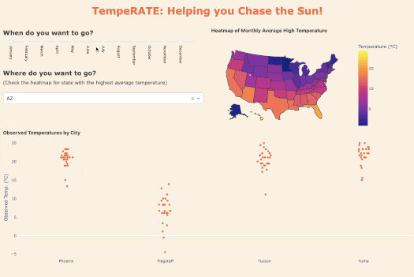

# tempeRATE - helping you chase the sun

Welcome! Thank you for visiting the tempeRATE project repository.

If you're an avid traveller and you want to find the perfect warm getaway for your next vacation, tempeRATE is made for you!

[Click here to use TempeRATE.](https://temperate.onrender.com/)

To learn more about the app, you can jump to one of the sections below or keep scrolling.

* [Proposal](#proposal)
* [Preview and Description](#preview-and-description)
* [Mini-persona](#mini-persona)
* [Dataset Reference](#dataset-reference)
* [Contributors and Contributing](#contributors-and-contributing)
* [Code of Conduct](#code-of-conduct)
* [License](#license)

## Proposal

The proposal is shared with Group 3's citytemp project and can be found [here](https://github.com/UBC-MDS/citytemp/blob/main/docs/proposal.md).

## Preview and Description

**"When do you want to go?"**

Users can select a `month` they plan to travel and from this selection, an interactive heatmap will display monthly temperature levels. The map is coloured according to degrees celsius units, but users can also hover over the state of their interest to view exact average temperature recording in degrees degrees Celsius (ºC) and Fahrenheit (ºF). 

**"Where do you want to go?"**

Next, after monthly averages have been compared, users can choose the US state of their interest and a strip plot will display the daily recorded temperature highs for the month they selected and in each city of their selected state. 

## Mini-persona

Anne is a resident of the Northwest Territories who dreams of ditching her parka and her toque to spend her next US vacation in September on a beach in the warmest city she can find! With TempeRATE, she observes Nevada has high temperatures for the month of September but what city should she go to? She observes the daily temperature records and settles on Las Vegas as her destination and also observes a visit early to mid-month will give her the best suntanning, margarita-sipping weather.  

## Dataset Reference

tempeRATE uses [this dataset](https://github.com/rfordatascience/tidytuesday/tree/master/data/2022/2022-12-20) collected by the [USA National Weather Service](https://www.weather.gov/) and shared by [TidyTuesday](https://github.com/rfordatascience/tidytuesday). 
Since the app is designed to display temperature levels and not forecasts of weather or precipitation, only the following columns have been utilized:  

- `date` date described by the observation
- `city` city
- `state` state
- `high_or_low` whether the observation was recorded as a high or low temperature of the day
- `observed_temp` the observed high or low temperature of the day

## Contributors and Contributing
This project was created for the UBC Master of Data Science program by Renee Kwon for DSCI 532 (Data Visualization II).

Feedback and suggestions are always welcome!
Please read the contributing guidelines [here](https://github.com/renee-kwon/tempeRATE/blob/main/CONTRIBUTING.md) to get started.

## Code of conduct
In the interest of fostering an open and welcoming environment, we as contributors and creators pledge to make participation in our project and our community a harassment-free experience for everyone, regardless of age, body size, disability, ethnicity, gender identity and expression, level of experience, nationality, personal appearance, race, religion, or sexual identity and orientation. Detailed descriptions of these points can be found in [CODE_OF_CONDUCT.md](https://github.com/renee-kwon/tempeRATE/blob/main/CODE_OF_CONDUCT.md).

## License
The tempeRATE Dashboard is [licensed](https://github.com/renee-kwon/tempeRATE/blob/main/LICENSE.md) under the terms of the MIT license.

